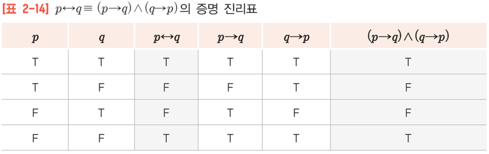
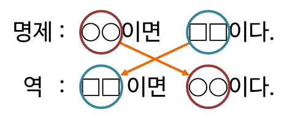
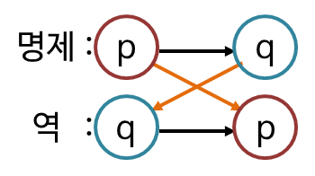
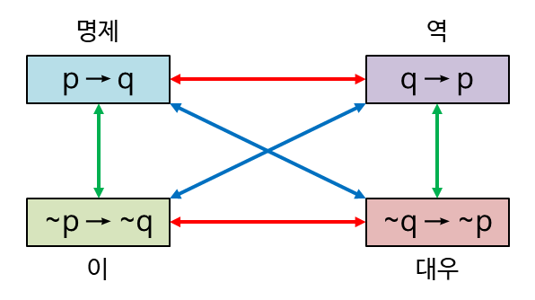
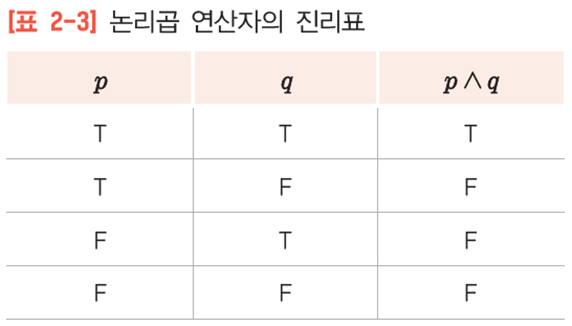
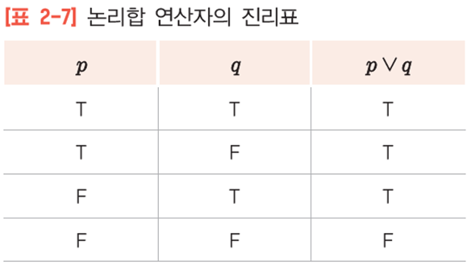
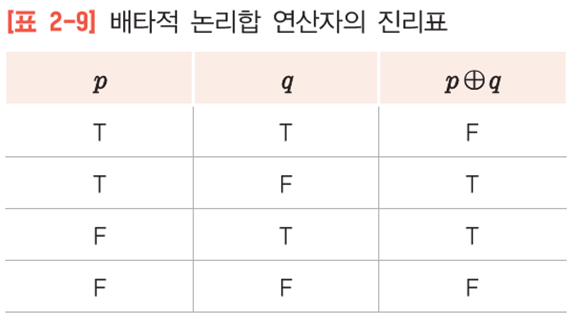
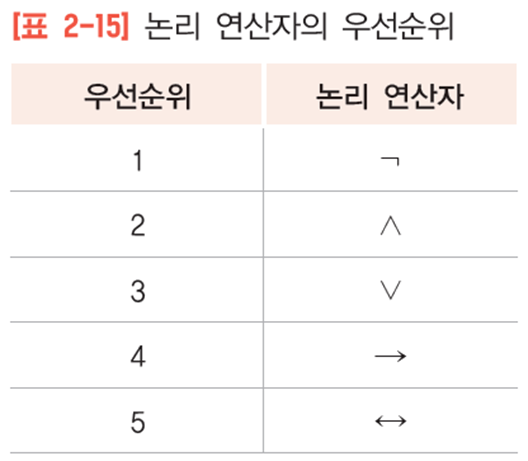

# 명제와 논리

# 명제(proposition)

명제란 그 내용이 참인지 거짓인지를 누구나 명확하게 판단할 수 있는 식을 말합니다.

ex) 2더하기 2는 4이다 : 참

ex) 2더하기 2는 6이다 : 거짓

ex) 토마토는 비싸다 : 참과 거짓을 판단할 수 없기에 명제가 아님

<aside>
 어떤 명제가 ‘p이면 q이다’의 형태로 표현될 때, 
p를 가정, q를 결론이라고 하며, p → q와 같이 나타낸다.

</aside>

## p가 False면 p→q는 True~이다.

명제 : 엄마가 집에 10시에 들어오면, 나는 무엇인가를 먹고 싶다

TT >> T, TF >> F 이며, 인과관계가 없는 문장이어도 참, 거짓 판단을 할 수 있다. 

p **⇔** q 필요충분조건

만약 p가 참이라면 q도 참이고, 만약 q가 거짓이면 p도 거짓이다. 

하지만, 전제가 거짓일 때에는 조건문이 참이 된다.

p **⇔** q 의 연산은 p → q, q → p의 and 연산이다. 그런데 F와 F를 연산하면 F가 나오기 때문에 and 연산에 위배되어 T인 것이다. 

# 역, 이, 대우

q → p 를 p → q의 역이라고 한다.

~p → ~q 를 p → q의 이라고 한다.

~q → ~p 를 p → q의 대우라고 한다.

1. **원 명제와 그 명제의 대우는 언제나 같은 불리언 값을 가집니다.**

ex) p → q / ~q → ~p

명제 : 숫자 a가 홀수이면, 3a는 홀수이다. (참)

대우 : 3a가 홀수가 아니면, 숫자 a는 홀수가 아니다 (참)

1. **원 명제의 역과 이는 언제나 같은 불리언 값을 가집니다.**

ex) 

명제 : 두 삼각형이 합동이면, 두 삼각형의 넓이는 같다 (참) p : 두 삼각형이 합동이다 → q : 넓이가 같다.

역 : 두 삼각형의 넓이가 같으면, 두 삼각형은 합동이다 (거짓) q : 두 삼각형의 넓이가 같다 → p : 합동이다.

이 : 두 삼각형이 합동이 아니면, 두 삼각형의 넓이는 다르다 (거짓) ~p : 두 삼각형이 합동이 아니다 → ~q : 넓이가 다르다.

# 논리

**논리 곱(AND : p ^ q)**

**논리합 (OR : p v q)**

**베타적 논리합 (XOR p⊕q)**

**논리연산자 우선순위**

** 참고 블로그

[[이산수학] 2. 명제와 논리](https://velog.io/@ahnbeingrockdo/이산수학-2.-명제와-논리)

[p이면 q에서 가정, 전제가 거짓일 때 조건문이 항상 참인 이유](https://hoohaha.tistory.com/71)

[코딩교육 티씨피스쿨](https://www.tcpschool.com/codingmath/proposition)